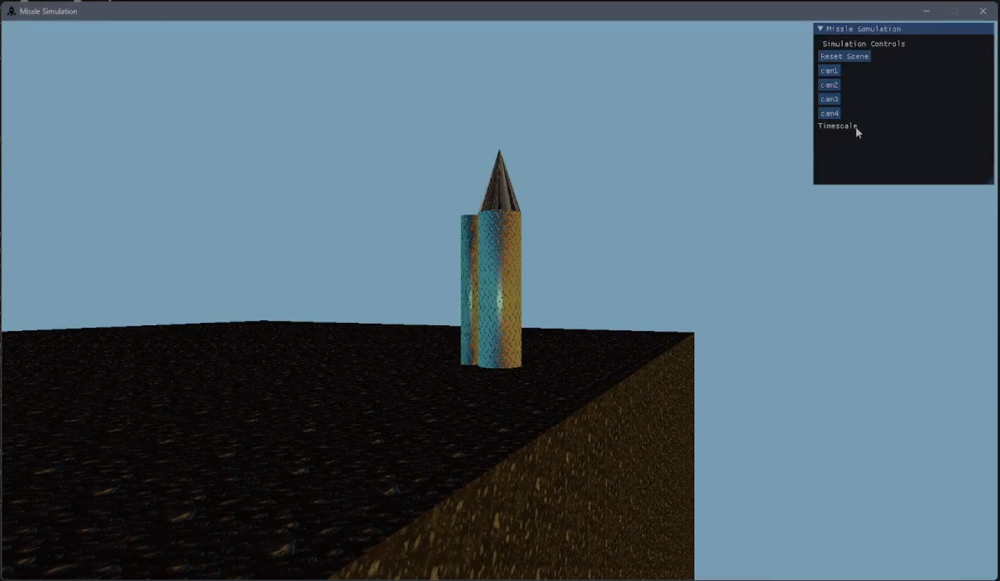

## Concept

The purpose was to simulate the test firing of a rocket and the subsequent explosive and deformation that occurs when the rocket impacts the ground surface (the terrain).

This is not intended as a realistic simulation.

### Terrain

The terrain is represented as a cuboid, made-up from a very large number of voxels.  
Each voxel is a small textured cube.

### Rocket

The rocket body consists of a body (cylinder) and nose (cone).
The surface details of the body of the rocket depend on the view positions:  a textured surface detail for a relatively distant view and a bumpy surface 
The nose of the rocket is shiny textured surface (chrome metallic surface)

### Launcher

The shape of the launcher is a simple textured cylinder.

### Animation

The rocket is launched into the air, following a basic projectile trajectory, There will be an explosion at the position where rocket impacts the terrain.

### Rocket engine

The rocket engine is implemented as a particle system

### Explosion

The explosion is implemented as particle systems providing both smoke and fire effects
As a result of the explosion a number of the voxels at the impact point are deleted, thereby creating a depression in the terrain surface. Repeat firings of the rocket will gradually alter the appearance of the terrain. 

Once the rocket has exploded, a new rocket spawns on the launcher

### Lighting

There are 4 light sources in this simulation:
1. Sun
2. Moon
3. Rocket engine particle system 
4. Explosion particle system

The sun and moon move across the terrain simulating a day / night cycle.

### Cameras

A numberof cameras are implemented, as follows:

- Camera 1:
Initially looking at the launcher
Adjustable via keyboard controls  (WASD KEYS)

- Camera 2:
Initially looking at the terrain surface
Adjustable via keyboard controls (WASD KEYS)

- Camera 3:
Looking at the rocket
Tracking the rocket as it flies

- Camera 4:
A close up of the rockets nose 
Tracking the rocket nose as it flies

- Camera 5:
A close up of the rockets body 
Tracking the rocket body as it flies

### Controls

- ‘ESC’ exits the application
- ‘r’ resets the application to its initial state
- Cameras are controlled by the cursor keys:
    - ‘left’/‘right’/’up’/’down’ rotate left/right/up/down, respectively
    - CTRL + ‘left’/‘right’/’up’/’down’/’page up’/’page down’ panning to left/right/forward/backward/up/down, respectively
    - Alternatively, w-a-s-d or i-j-k-l keys may be used instead of the “cursor” keys
- Function keys F1 to F5 will select cameras C1 to C5, respectively
- Function key F6 switched between render modes: wire frame, diffuse (non-textured), diffuse (textured), diffuse (textured) with displacement mapping, and toon/cel shading
- ‘<’ / ‘>’ to decrease/increase the pitch of the launcher.
- Function key F11, to launch the rocket.
- Keys 't'/'T' decrease/increase a factor that globally slows/speeds-up time-dependent effects

### Shading

bump mapping on geometry of terrain.
displacement mapping on geometry of rocket texture.

### UI

  
Using IMGUI For HUD. 

## Implementation

Only the following libraries and APIs were Used :
- DirectX 11 SDK
- IMGUI 

The Project used C++.
